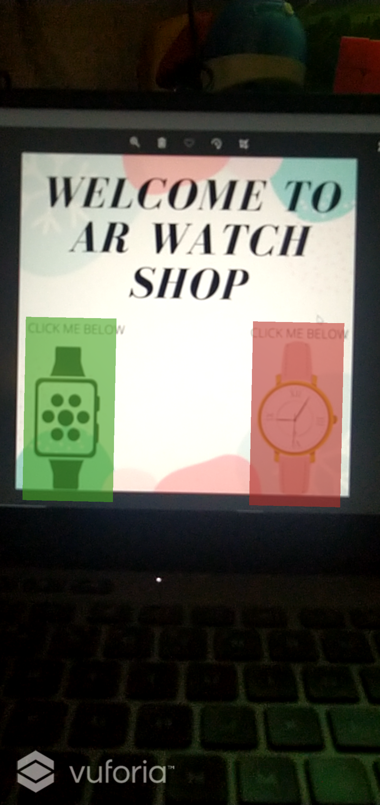
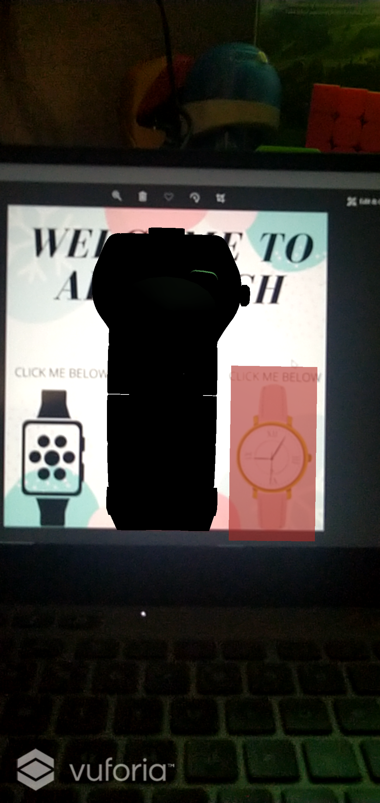
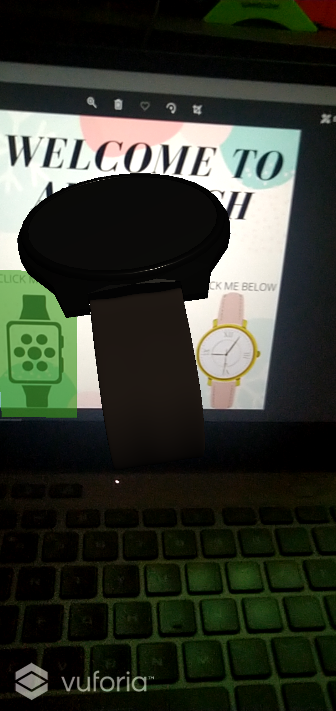
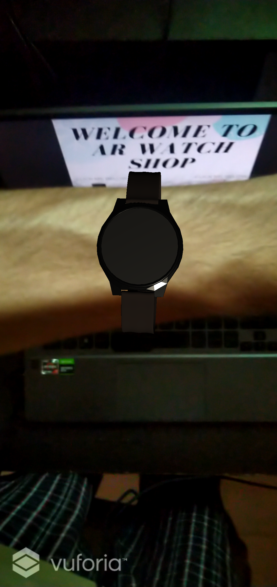

# WatchAR-Project

> ### Official winning submission in the [echoAR category](https://twitter.com/wilder569/status/1416516166726479872?s=20) at [Hack the Mountains 2.0](https://hackthemountain.tech/) hackathon. 

## About the project : 
 The Project WatchAR gives the user a deeper dive into the future by engaging them through an Augmented Reality Experience.

## How to use : 
 STEP 1 - To run the app a user needs to scan our particular [“image-target”](https://github.com/Dhruv-194/WatchAR-Project/blob/master/Image%20Target/WElcome_to_ar_watch_shop.png) (which is the advertisement of the wrist watch company, created by us in our case). Then the user needs to click on the AR button and observe the appeared wrist watches.
 
 STEP 2 - The user can then view the wrist watch and even augment it on his/her wrist and see how it might look when they buy it in real life. 

## Technologies used : 

 

 

## NOTE : 
This Project is a prototype developed during the hackathon time period of 36hrs, so in no way is this a fully developed app just a concept idea of telling how the shopping might look like in the future using Augmented Reality. 

## PPT Link :
- https://drive.google.com/file/d/1UkqGuLChov9Wbi4jX_Eo_OrtMv4coO5r/view?usp=sharing

## APK Link : 
(Subjected to the hardware compatibility of the phone) 
- https://drive.google.com/file/d/1XBE4Eto3CbQcTgIj4tqe2pWIi3hE6sXK/view?usp=sharing

## Video Link : 
- [Demo YouTube Video](https://youtu.be/cCqubOFKuk8)

## Screenshots of the app 

  
 
 

